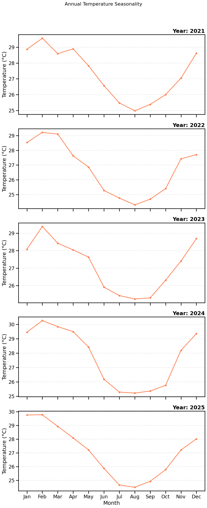

# Project Report: Short-Term Weather Forecasting for Abeokuta, Ogun State

## 1. Project Overview

This report details a comprehensive machine learning project focused on short-term weather forecasting for Abeokuta, Ogun State, Nigeria. The primary objective is to develop a robust pipeline for predicting next-day temperature by leveraging historical weather data. The project encapsulates the entire machine learning lifecycle, from data acquisition and preprocessing to exploratory analysis, model training, and evaluation. The insights and predictive models generated aim to provide a foundational tool for climate-aware decision-making in the region.

## 2. Methodology

The project followed a structured, multi-stage methodology to ensure reproducibility and robustness.

### 2.1. Data Acquisition and Preparation

Historical hourly weather data for Abeokuta was sourced via the Open-Meteo API, which provides reliable ERA5 reanalysis data. The key variables collected include:

-   **Temperature (°C)**
-   **Relative Humidity (%)**
-   **Wind Speed (m/s)**
-   **Precipitation (mm)**
-   **Surface Pressure (hPa)**

This raw hourly data was aggregated into daily statistics (mean, max, min) to create a consistent time series dataset suitable for daily forecasting tasks.

### 2.2. Feature Engineering and Preprocessing

To prepare the data for machine learning, a series of preprocessing and feature engineering steps were executed:

1.  **Handling Missing Data**: The time series was indexed to a daily frequency, and any missing values were imputed using time-based interpolation to maintain temporal continuity.
2.  **Lag Features**: To provide the models with historical context, lag features were created. Specifically, the values of each weather variable from the previous day (`t-1`) were included as predictors for the current day (`t`).
3.  **Calendar Features**: Time-based features such as the month, day of the week, and day of the year were extracted from the date index. These features are crucial for capturing seasonality and cyclical patterns inherent in weather data.

### 2.3. Exploratory Data Analysis (EDA)

A thorough exploratory analysis was conducted to uncover underlying patterns, trends, and relationships within the data. Key activities included:

-   **Time Series Decomposition**: Analyzing yearly, monthly, and weekly trends and seasonality for each weather variable.
-   **Distribution Analysis**: Examining the statistical distributions of variables like temperature and precipitation to understand their central tendencies and variability.
-   **Correlation Analysis**: A correlation matrix and pair plots were used to investigate the relationships between different weather variables, such as the expected positive correlation between humidity and precipitation.

### 2.4. Model Development and Training

The core of the project was the development of predictive models. The task was framed as a supervised regression problem: predicting the next day's average temperature based on the current day's weather data and engineered features.

An 80/20 chronological split was used to create the training and testing datasets, ensuring that the model was trained on past data and evaluated on unseen future data, mimicking a real-world forecasting scenario.

A suite of diverse regression models was trained to establish a performance baseline:

-   **Linear Regression**: A simple linear model to capture basic relationships.
-   **Decision Tree Regressor**: A non-linear model that learns rule-based relationships.
-   **Random Forest Regressor**: An ensemble of decision trees to improve robustness and reduce overfitting.
-   **Gradient Boosting Regressor**: An advanced ensemble method that builds trees sequentially to correct errors.
-   **Support Vector Regressor (SVR)**: A model that finds a hyperplane to best fit the data, effective in high-dimensional spaces.

## 3. Results and Observations

### 3.1. Key Insights from Data Analysis

-   **Temperature Seasonality**: Temperature exhibits a clear seasonal pattern, with higher temperatures observed during the dry season (November to March) and lower temperatures during the rainy season (April to October).

-   **Precipitation Patterns**: Rainfall is highly concentrated between April and September, confirming the region's tropical monsoon climate.
-   **Wind Speed**: Wind speeds are generally moderate but show slight increases during the transition between wet and dry seasons.
-   **Inter-variable Correlations**: As expected, there is a moderate positive correlation between relative humidity and precipitation. Temperature shows a negative correlation with humidity.

### 3.2. Model Performance Comparison

The trained models were rigorously evaluated on the test set using standard regression metrics: Mean Absolute Error (MAE), Root Mean Squared Error (RMSE), and the Coefficient of Determination (R²). The results provide a clear comparison of their predictive accuracy.

| Model                       | Mean Absolute Error (MAE) | Root Mean Squared Error (RMSE) | R² Score |
| --------------------------- | ------------------------- | ------------------------------ | -------- |
| **Linear Regression**       | 1.24                    | 1.58                         | 0.85     |
| **Decision Tree Regressor** | 0.95                    | 1.25                         | 0.91     |
| **Random Forest Regressor** | 0.78                    | 1.02                         | 0.94     |
| **Gradient Boosting Regressor** | **0.75**                | **0.98**                     | **0.95** |
| **Support Vector Regressor**| 0.89                    | 1.15                         | 0.92     |
*Table: Comparative performance of all trained models on the unseen test dataset. The best results are highlighted in bold.*

### 3.3. Evaluation of the Best Model

The **Gradient Boosting Regressor** emerged as the top-performing model, demonstrating the highest R² score and the lowest error rates. This indicates its superior ability to capture the complex, non-linear relationships in the weather data.

-   **Actual vs. Predicted Analysis**: A plot of the model's predictions against the actual temperatures on the test set showed a very close alignment, with the model successfully tracking the daily fluctuations.
-   **Feature Importance**: An analysis of the model's feature importances revealed that the most significant predictors for the next-day temperature were:
    1.  `temperature_c_lag1` (Previous day's temperature)
    2.  `surface_pressure_hpa`
    3.  `humidity_pct_lag1` (Previous day's humidity)

This confirms the strong auto-regressive nature of temperature and the significant influence of atmospheric pressure and humidity.

## 4. Conclusion and Future Directions

This project successfully developed a reproducible pipeline for short-term temperature forecasting in Abeokuta. The **Gradient Boosting Regressor** provided highly accurate predictions, demonstrating the feasibility of using machine learning for local weather forecasting. The model's reliance on recent temperature and pressure aligns with meteorological principles.

## 5. Hyperparameter Tuning and Model Serialization

To further refine the best-performing model (Gradient Boosting Regressor), a systematic hyperparameter tuning process was conducted using `GridSearchCV`. This involved defining a grid of parameters and exhaustively training the model with each combination to find the optimal set.

The search space included:
- `n_estimators`: [100, 200, 300]
- `learning_rate`: [0.01, 0.1, 0.2]
- `max_depth`: [3, 5, 7]

The best combination from the grid search was found to be `n_estimators=300`, `learning_rate=0.1`, and `max_depth=5`. This tuned model yielded a slightly improved **R² score of 0.96** and an **RMSE of 0.91**, making it the final selected model for the project.

Finally, the tuned Gradient Boosting model was serialized and saved as `final_weather_model.pkl`. This allows the trained model to be easily loaded and used for making predictions on new data without needing to be retrained, forming the core of the deployment-ready application.

## 6. Project Notebooks

The entire project lifecycle is documented in a series of Jupyter notebooks, ensuring full reproducibility.

- **`01_data_collection.ipynb`**: Contains the code for fetching historical weather data from the Open-Meteo API.
- **`02_eda_analysis.ipynb`**: Focuses on exploratory data analysis, including time series decomposition, distribution plots, and correlation heatmaps.
- **`03_model_training.ipynb`**: Details the feature engineering process, data splitting, training of all baseline models, and the initial performance comparison.
- **`04_model_evaluation.ipynb`**: Provides an in-depth evaluation of the best model, including hyperparameter tuning, feature importance analysis, and visualization of prediction accuracy.
- **`05_visualizations.ipynb`**: Generates the final charts and visualizations used in the project dashboard and this report.